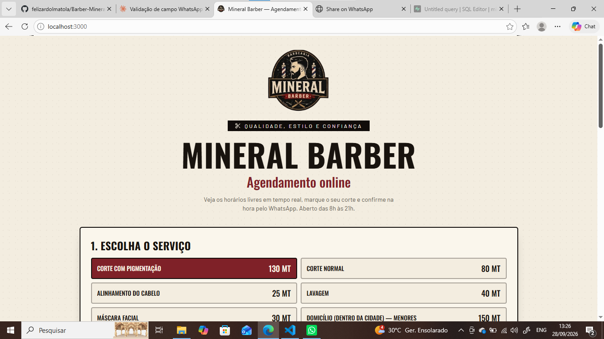
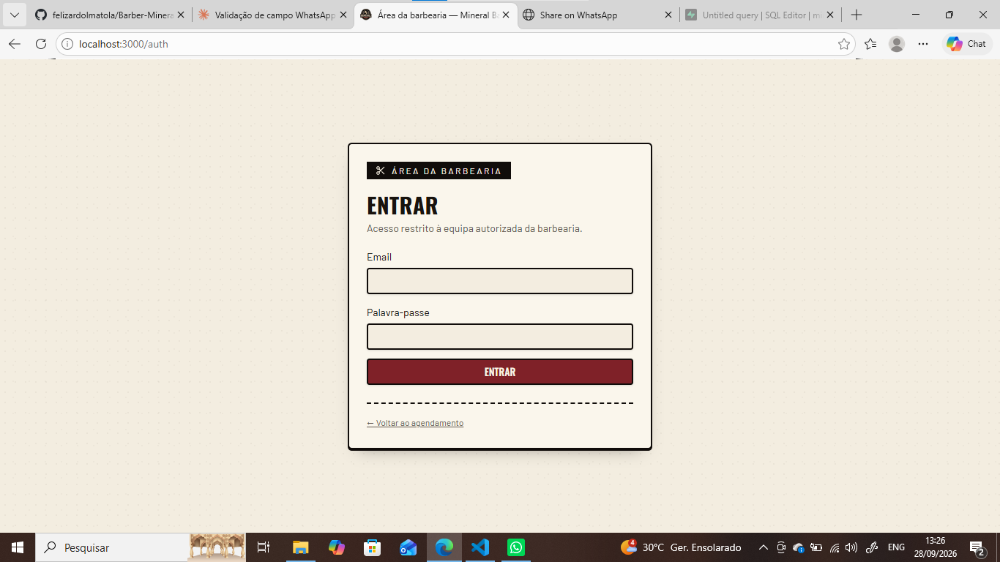

# ✂️ Mineral Barber — Agendamento online

Aplicação web para marcação de cortes na **Mineral Barber**. O cliente escolhe o serviço, o dia e o horário, vê a disponibilidade em tempo real e confirma pelo WhatsApp. A equipa da barbearia tem uma área privada para confirmar, cancelar e acompanhar as marcações do dia.

É uma SPA em React, sem servidor próprio: o browser fala directamente com o Supabase, e a segurança é garantida por políticas RLS na base de dados.


---

## 📸 Pré-visualização

### Página de agendamento (cliente)

O cliente vê os serviços com preços em MT, escolhe o dia, o horário e preenche os dados de contacto.



### Área da barbearia (equipa)

Acesso restrito por email e palavra-passe. Só contas com papel de administrador ou staff entram no painel.



---

## ✨ Funcionalidades

### Para o cliente
- **Escolha do serviço**, na barbearia ou ao domicílio, com preços transparentes em MT.
- **Escolha do dia e do horário**, das 8h às 21h.
- **Disponibilidade em tempo real:** os horários ocupados ficam riscados e desativados, sem precisar de atualizar a página.
- **Horários que já passaram ficam indisponíveis** automaticamente, calculados com a hora de Maputo (`Africa/Maputo`) e não com o relógio do dispositivo.
- **Campo WhatsApp validado:** só aceita números inteiros, com exactamente 9 dígitos. O prefixo `+258` é acrescentado pela aplicação.
- **Confirmação por WhatsApp:** depois de agendar, abre-se uma conversa com a mensagem da marcação já escrita.

### Para a equipa
- **Painel de gestão** com as marcações do dia, actualizado em tempo real.
- **Resumo do dia:** pendentes, confirmados, horas livres e receita.
- **Confirmar, cancelar ou apagar** marcações.
- **Botão de WhatsApp** para falar com o cliente, com mensagem de confirmação pronta.
- **Autenticação com controlo de acesso por papéis** (`admin` e `staff`).

---

## 🧱 Stack

| Camada | Tecnologia |
| --- | --- |
| Interface | React 19, TypeScript, Tailwind CSS v4 |
| Rotas | React Router (SPA) |
| Dados e cache | TanStack Query |
| Build | Vite |
| Backend | Supabase (autenticação, PostgreSQL, Realtime, RLS) |
| Deploy | Vercel |

---

## 🔐 Como funciona a segurança

Não há servidor próprio. Toda a protecção vive no Supabase:

- **Qualquer pessoa pode criar uma marcação** (política de `INSERT` para o papel `anon`).
- **Só a equipa pode ver, actualizar e apagar** marcações. As políticas RLS consultam a tabela `user_roles`.
- **A rota `/gestao`** é protegida pelo componente `RequireAuth`, que exige sessão válida e um papel `admin` ou `staff`.
- **Um gatilho na base de dados** recusa marcações em horários que já passaram, mesmo que alguém tente contornar o site.
- A aplicação usa apenas a chave **publishable** do Supabase. A `service_role` nunca é usada no front-end.

---

## 🚀 Executar localmente

Requisitos: **Node.js 20+** e **npm**.

```bash
git clone https://github.com/felizardolmatola/Barber-Mineral.git
cd Barber-Mineral
npm install
cp .env.example .env.local
npm run dev
```

A aplicação fica disponível em `http://localhost:3000`.

### Variáveis de ambiente

| Variável | Descrição |
| --- | --- |
| `VITE_SUPABASE_URL` | URL pública do projeto Supabase |
| `VITE_SUPABASE_PUBLISHABLE_KEY` | Chave pública (publishable/anon) do Supabase |

Os valores estão no Supabase, em **Project Settings → API**.

### Scripts

```bash
npm run dev         # servidor de desenvolvimento
npm run typecheck   # verificação de tipos
npm run lint        # análise estática
npm run build       # gera os ficheiros estáticos em dist/
```

---

## 🗄️ Configuração da base de dados

As migrações SQL ficam em `drizzle/migrations/`. Além das tabelas de agendamentos, a área da equipa precisa de uma tabela de papéis e de políticas de acesso. No **SQL Editor** do Supabase:

### 1. Tabela de papéis

```sql
create table if not exists public.user_roles (
  id uuid primary key default gen_random_uuid(),
  user_id uuid not null references auth.users(id) on delete cascade,
  role text not null check (role in ('admin', 'staff')),
  unique (user_id, role)
);

alter table public.user_roles enable row level security;

create policy "utilizador le o proprio papel"
on public.user_roles for select
to authenticated
using (user_id = auth.uid());
```

### 2. Políticas da equipa em `agendamentos`

```sql
create policy "admin ve agendamentos"
on public.agendamentos for select
to authenticated
using (exists (
  select 1 from public.user_roles r
  where r.user_id = auth.uid() and r.role in ('admin', 'staff')
));

create policy "admin actualiza agendamentos"
on public.agendamentos for update
to authenticated
using (exists (
  select 1 from public.user_roles r
  where r.user_id = auth.uid() and r.role in ('admin', 'staff')
));

create policy "admin apaga agendamentos"
on public.agendamentos for delete
to authenticated
using (exists (
  select 1 from public.user_roles r
  where r.user_id = auth.uid() and r.role in ('admin', 'staff')
));
```

### 3. Bloquear horários passados

```sql
create or replace function public.bloquear_horario_passado()
returns trigger
language plpgsql
as $$
begin
  if (new.data + new.hora::time) <= (now() at time zone 'Africa/Maputo') then
    raise exception 'Esse horário já passou.';
  end if;
  return new;
end;
$$;

create trigger trg_bloquear_horario_passado
before insert on public.agendamentos
for each row execute function public.bloquear_horario_passado();
```

### 4. Criar o primeiro administrador

1. Em **Authentication → Users → Add user**, crie o utilizador com **Auto Confirm User** marcado.
2. Dê-lhe o papel de administrador (troque o email pelo real):

```sql
insert into public.user_roles (user_id, role)
values ((select id from auth.users where email = 'email-do-admin@exemplo.com'), 'admin');
```

---

## ☁️ Deploy na Vercel

O projeto é uma SPA estática. O `vercel.json` reescreve qualquer rota (`/auth`, `/gestao`, etc.) para `index.html`, deixando o React Router tratar da navegação.

1. Envie o código para o GitHub.
2. Na Vercel, **Add New → Project** e escolha o repositório. O framework é detetado como **Vite**.
3. Em **Environment Variables**, adicione `VITE_SUPABASE_URL` e `VITE_SUPABASE_PUBLISHABLE_KEY`.
4. Clique em **Deploy**.
5. No Supabase, em **Authentication → URL Configuration**, defina o endereço da Vercel em **Site URL** e em **Redirect URLs**.

Fazer novo deploy ou publicar código no GitHub **não apaga** os dados do Supabase.

---

## 📁 Estrutura do projecto

```text
src/
├── pages/
│   ├── Home.tsx          # agendamento público (/)
│   ├── Auth.tsx          # entrada da equipa (/auth)
│   ├── Gestao.tsx        # painel de gestão (/gestao)
│   └── NotFound.tsx
├── components/
│   ├── layout/
│   │   ├── RequireAuth.tsx   # protecção da rota /gestao
│   │   └── ErrorBoundary.tsx
│   └── ui/               # componentes de interface
├── lib/
│   ├── barbearia.ts      # serviços, horários e mensagens de WhatsApp
│   └── fuso.ts           # hora de Maputo e horários passados
├── integrations/supabase/
│   └── client.ts         # cliente Supabase
├── hooks/
└── App.tsx, main.tsx
```

---

## 🔒 Segurança — nunca faça commit de

- `.env` e `.env.local`
- tokens privados
- credenciais administrativas
- a chave `service_role` do Supabase

---

## 👤 Autor

**Felizardo Matola** — Desenvolvedor Full Stack

- GitHub: [@felizardolmatola](https://github.com/felizardolmatola)
- LinkedIn: Felizardo Matola
